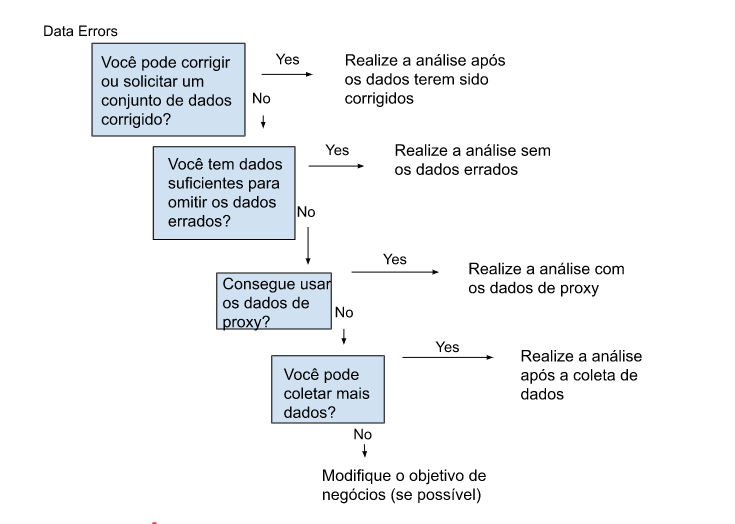

# Data analysis phases:

1 Ask

2 Prepare

3 Process

4 Analyze

5 Share

6 Act

# Database definition:

A collection of data stored in a computer system

# Relational database definition:

A database that contains a series of related tables that can be connected via their relationships

- Primary key: An identifies that references a column in which each value is unique 
- Foreign key: A field within a table that is a primary key in another table
- Metadata is used in database management to help data analysts interpret the contents of the data within the database

# Common types of metadata

- Descriptive
- Structural
- Administrative

Data e hora = metadado administrativo

Os Conjuntos de dados públicos do Google Cloud permitem aos analistas de dados o acesso a conjuntos de dados públicos de alta demanda, e facilitam a descoberta de insights na nuvem. 

A Pesquisa de conjunto de dados pode ajudá-lo a encontrar conjuntos de dados disponíveis on-line com pesquisas de palavras-chave. 

A Kaggle tem uma função de busca de dados abertos que pode ajudá-lo a encontrar conjuntos de dados para praticar.

Finalmente, a BigQuery hospeda mais de 150 conjuntos de dados públicos que você pode acessar e utilizar. 

# Structured query language (SQL)

A language to comunicate to databases

SELECT é a seção de uma consulta que indica quais dados você quer que o SQL retorne a você

FROM é a seção de uma consulta que indica de qual tabela provêm os dados desejados.

WHERE está a seção de uma consulta que indica qualquer filtro que você gostaria de aplicar ao seu conjunto de dados

# Data security

Protecting data from unauthorized access or corruption by adopting safety measures 

## Criptografia
A criptografia usa um algoritmo único para alterar dados e torná-los inutilizáveis por usuários e aplicativos que desconheçam o algoritmo, que é salvo como uma “chave” que pode ser usada para revogar a criptografia. Dessa forma, se você tem a chave, você ainda pode usar os dados em seu formato original.  

## Tokenização
A tokenização, por sua vez, substitui os elementos dos dados que você quer proteger com dados gerados de forma aleatória, conhecidos como “token”. Os dados originais são armazenados em um local separado e atribuídos aos tokens. Para ter acesso aos dados originais completos, o usuário ou o aplicativo precisa ter permissão para usar o dado tokenizado e o mapeamento do token, ou seja, mesmo que o dado tokenizado seja hackeado, o dado original continua seguro em um local separado. 

# Flowchart to cope with incomplete or data with errors

# Spreadsheet for sample size estimate based on confidence interval
https://docs.google.com/spreadsheets/d/1WrHqkxWo3JnFsbnlF-IY5ZLm6-nQKFGBQuAEraLKg9o/edit?resourcekey=0-VCs_I4_LM2Kkqf5WNU2H3A#gid=0

# Spreadsheet for margin of error estimate
https://docs.google.com/spreadsheets/d/1y3QQhgsSvQFm2QSs15CHER0K7w9zQb25G5twD-G-OKE/edit#gid=77526548

# Dirty data
Data that is incomplete, incorret, or irrelevant to the problem you're trying to solve

# Data engineers
Transform data into a useful format for analysis and give it a reliable infrastructure

# Data warehousing specialists
Develop processes and procedures to effectively store and organize data

# Types of dirty data
- Duplicates
- Outdated
- Incomplete
- Incorrect
- Inconsistent 

# Merger
An agreement that unites two organizations into a single new one

# Data merging
The process of combining two or more datasets into a single dataset

# Compatibility
How well two or more datasets are able to work together

# Tips to format and clean data:
[Guide to excel]([https://www.example.com](https://support.microsoft.com/en-us/office/top-ten-ways-to-clean-your-data-2844b620-677c-47a7-ac3e-c2e157d1db19)https://support.microsoft.com/en-us/office/top-ten-ways-to-clean-your-data-2844b620-677c-47a7-ac3e-c2e157d1db19)
[Guide to Google workspace](https://support.google.com/a/users/answer/9604139?hl=en#zippy=)

# Conditional formatting
A spreadsheet tool that changes how cells appear when values meet specific conditions

# Remove duplicates
A tool that automatically searches for and eliminates duplicate entries from a spreadsheet

# Function
A set of instructions that performs a specific calculation using the data in a spreadsheet

# Specific functions in Excel
## COUNTIF
Return the number of cells that match a specified value

## TRIM
A function that removes leading, trailing, and repeated spaces in data

## VLOOKUP
A function that searches for a certain value in a column to return a corresponding piece of information

# Links with tips about automatization in data cleaning processes 
[Towards Data Science’s automatização da análise de dados científicos](https://towardsdatascience.com/automating-scientific-data-analysis-part-1-c9979cd0817e)
[MIT news automatizando a análise de big-data](https://news.mit.edu/2016/automating-big-data-analysis-1021)
[TechnologyAdvice's 10 das melhores opções para software de automação do fluxo de trabalho](https://technologyadvice.com/blog/information-technology/top-10-workflow-automation-software/)

# Pivot table
A data summarization tool that is used in data processing

# Data mapping
The process of matching fields from one data source to another

# Differences between Spreadsheets and SQL

| Spreadsheets | SQL |
| ----------- | ----------- |
| Generated with a program | A language used to interact with database programs |
| Access to the data you input | Can pull information from different sources in the database |
| Stored locally | Stored across a database |
| Small datasets | Larger datasets |
| Working independently | Tracks changes across teams |
| Built-in functionalities | Used across multiple programs | 

# Typecasting
Converting data of a type to another

Obter dados de uma tabela usando instruções SELECT.

Deduplicar dados usando comandos como DISTINCTe COUNT + WHERE.

Manipular dados de string com TRIM(), SUBSTR, e LENGTH.

Criar/eliminar tabelas com CREATE TABLE e DROP TABLE.

Alterar os tipos de dados com CAST.

# Verification
A process to confirm that a data-cleaning effort was well-executed and the resulting data is accurate and reliable. 

# Changelog 
A file containing a chronologically ordered list of modification made to a project

# See the big picture when verifying data-cleaning
1 Consider the business problem

2 Consider the goal

3 Consider the data

# Identificar problemas mais comuns e corrijí-los:

- Origem dos erros. Você usou as ferramentas e funções certas para encontrar a origem dos erros no seu conjunto de dados?

- Dados nulos. Você procurou por NULOS com filtros e formatação condicional?

- Palavras digitadas incorretamente. Você localizou todas as palavras com erro de digitação?

- Números digitados incorretamente. Você verificou se os dados numéricos foram digitados corretamente?

- Caracteres e espaços extras. Você excluiu os caracteres ou espaços extras com a função TRIM?

- Duplicatas. Você excluiu as duplicatas nas planilhas ou SQL com as funções Remove duplicates ou DISTINCT, respectivamente?

- Tipos de dados incompatíveis. Você verificou se os dados numéricos, de datas e strings foram convertidos corretamente?

- Strings desorganizadas (inconsistentes). Você verificou se todas as strings são consistentes e pertinentes?

- Formatos de dados desorganizados (inconsistentes). Você formatou as datas de forma consistente no conjunto de dados?

- Identificações (colunas) variáveis incorretas. Você nomeou suas colunas de forma adequada?

- Dados truncados. Você verificou se há dados ausentes ou truncados que exigem correção?

- Lógica nos negócios. Com base em seu conhecimento nos negócios, você verificou se os dados são coerentes? 

# How to access version control in different tools:

| Planilhas Google | Microsoft Excel | BigQuery | 
| ----------- | ----------- | ----------- |
| 1. Clique com o botão direito na célula e selecione "Exibir histórico de edição". 2. Clique nas setas para a esquerda (<) ou direita (>) para ir para frente ou para trás no histórico, conforme necessário | 1. Se o recurso de Controlar Alterações estiver habilitado na planilha: clique em "Revisão". 2. Em Controlar alterações, clique na opção "Aceitar/Rejeitar alterações" para aceitar ou rejeitar as mudanças feitas | Abra uma versão anterior (sem voltar para ela) e compare-a à versão atual para ver o que mudou |

# Todas as mudanças de cada categoria devem ser agrupadas juntas. Os tipos de alterações se classificam, normalmente, em uma das categorias abaixo:

- Adicionado: novos recursos incorporados

- Alterado: mudanças na funcionalidade já existente

- Obsoleto: recursos prestes a serem removidos

- Removido: recursos que foram removidos

- Corrigido: correções de erros

- Segurança: mitigação de vulnerabilidades

# Example of changelog (in markdown):

# Changelog
This file contains the notable changes to the project

Version 1.0.0 (02-23-2019)
## New
    - Added column classifiers (Date, Time, PerUnitCost, TotalCost, etc. )
    - Added Column “AveCost” to track average item cost

## Changes 
    - Changed date format to MM-DD-YYYY
    - Removal of whitespace (cosmetic)

## Fixes
    - Fixed misalignment in Column "TotalCost" where some rows did not match with correct dates
    - Fixed SUM to run over entire column instead of partial

# Common data errors
- Human error in data entry
- Flawed processes
- System issues

# Functions to a fast data cleaning:
| Function | Sintaxe (Google sheets) | Microsoft Excel | Main use |
| ----------- | ----------- | ----------- | ----------- |
| IMPORTRANGE | =IMPORTRANGE(spreadsheet_url, range_string) | Colar link (copiar os dados primeiro) | Importa (cola) dados de uma planilha para outra e os mantém atualizados automaticamente| 
| QUERY | Sintaxe: =QUERY(Planilha e Intervalo, "Select *") | Dados > De outras fontes > Da consulta Microsoft | Permite que instruções falsas do SQL (do tipo SQL) ou um assistente importem os dados | 
| FILTER | =FILTER(intervalo, condição1 [condição2, ...]) | Filtrar(condições por coluna) | Exibe somente os dados que atendem às condições especificadas |

# Phases of analysis 
1 Organize data

2 Format and adjust data

3 Get input from others

4 Transform data

# Data validation options:
- Add dropdown lists with predetermined options
- Create custom checkboxes
- Protect structured data and formulas

[Regras de conversão em SQL](https://cloud.google.com/bigquery/docs/reference/standard-sql/conversion_rules)

# Data aggregation
The process of gathering data from multiple sourcer in order to combine it into a single summarized collection

# Subquery
A query within another query

# Join
A SQL clause that is used to combine rows from two or more tables based on a related column

# Types of Join:
- Inner = returns records with matching values in both tables
- Left = return all the records from the left table and only the matching records from the right table
- Right = return all records from the right table and only the matching records from the left
- Full outer = combines right and left join to return all matching records in both tables

# Aliasing
When you temporarily name a table or column in your query to make it easier to read and write. 

# Data validation process
Checking and rechecking the quality of your data so that it is complete, accurate, secure and consistent. 

# Tipos de validação de dados:

| Tipo | Propósito | Exemplo | Limitações |
| ----------- | ----------- | ----------- | ----------- |
| Tipo de dado | Verificar se os dados correspondem ao tipo de dados definido para um campo | Os valores de dados para as séries escolares de 1 a 12 devem ser um tipo de dados numérico | O valor de dados 13 passaria na validação do tipo de dados, mas seria um valor inaceitável. Para este caso, a validação do intervalo de dados também é necessária| 
| Intervalo de dados | Verificar se os dados estão dentro de um intervalo aceitável de valores definidos para o campo | Os valores dos dados para as séries escolares devem ser valores entre 1 e 12 | O valor de dados 11,5 estaria no intervalo de dados e também passaria como um tipo de dados numérico. Mas, seria inaceitável porque não há meias séries. Para este caso, a validação da restrição de dados também é necessária | 
| Restrições de dados | Verificar se os dados atendem a determinadas condições ou critérios para um campo. Isso inclui o tipo de dados inseridos, bem como outros atributos do campo, como número de caracteres | Restrição de conteúdo: Os valores de dados para as séries escolares de 1 a 12 devem ser números inteiros | O valor de dados 13 é um número inteiro e passaria na validação de restrição de conteúdo. Mas seria inaceitável, já que 13 não é uma série escolar reconhecida. Para este caso, a validação do intervalo de dados também é necessária |
| Consistência de dados | Verificar se os dados fazem sentido no contexto de outros dados relacionados | Os valores de dados para as datas de envio do produto não podem ser anteriores às datas de produção do produto | Os dados podem ser consistentes, mas ainda incorretos ou imprecisos. Uma data de envio pode ser posterior a uma data de produção e ainda estar errada |
| Estrutura de dados | Verificar se os dados seguem ou estão em conformidade com uma estrutura definida | As páginas da web devem seguir uma estrutura prescrita para serem exibidas corretamente | Uma estrutura de dados pode estar correta com os dados ainda incorretos ou imprecisos. O conteúdo de uma página da web pode ser exibido corretamente e ainda conter as informações erradas |
| Validação de código | Verificar se o código do aplicativo executa sistematicamente qualquer uma das validações mencionadas anteriormente durante a entrada de dados do usuário | Problemas comuns descobertos durante a validação de código incluem: mais de um tipo de dados permitido, verificação de intervalo de dados não feita ou final de strings de texto mal definido | A validação de código pode não validar todas as variações possíveis com entrada de dados |

# Temporary table
A database table that is created and exists temporarily on a database server

# Data visualization
The graphic representation and presentation of data

# Four key elements of data visualization (David McCandless method):
1 Information (data)

2 history (concept)

3 Goal (function)

4 Visual form (metaphor)

# Atributos pré-atencionais: 
## Marcas: As marcas são objetos visuais básicos como pontos, linhas e formas. Cada marca pode ser dividida em quatro qualidades
- Posição: onde uma marca específica está no espaço em relação a uma escala ou outras marcas
- Tamanho: o quanto uma marca é grande, pequena, longa ou alta
- Forma: se um objeto específico recebe uma forma que comunica algo sobre ele
- Cor: qual é a cor da marca

## Canais: Os canais são aspectos visuais ou variáveis que representam características dos dados. Os canais são basicamente marcas que foram usadas para visualizar dados. Os canais variam em termos de eficácia na comunicação de dados com base em três elementos
- Precisão: os canais são úteis para estimar com precisão os valores representados?
- Popout: o quanto é fácil distinguir certos valores de outros?
- Agrupamento: o quanto um canal é bom na comunicação de grupos que existem nos dados?

# Dynamic visualizations
Visualizations that are interactive or change over time. 

# Tableau
A business intelligence and analytics platform that helps people see, understand, and make decisions with data. 

# Five phases of the design process:
1 Empathize - pensar nas emoções e necessidades do público-alvo para a visualização de dados 

2 Define - descobrir exatamente o que seu público precisa a partir dos dados

3 Ideate - gerar ideias para visualização de dados

4 Prototype - reunir visualizações para teste e feedback

5 Test - amostra de protótipos de visualizações para que as pessoas vejam antes das partes interessadas

Design Thinking é um processo usado para resolver problemas complexos de uma forma centrada no usuário. O foco no usuário significa considerar o usuário e suas necessidades em primeiro lugar.

# My first data visualization with tableau:
https://prod-useast-b.online.tableau.com/#/site/alvesds/views/learning_to_use_tableau_co2_data/Sheet1?:iid=4

# 3 data storytelling steps
1 Engage your audience 

2 Create compelling visuals

3 Tell the story in an interesting narrative

# Spotlighting
Scanning through data to quickly identify the most important insights

# Dados estáticos envolvem fornecer capturas de tela ou instantâneos nas apresentações, ou construir painéis usando instantâneos de dados. Há prós e contras no uso de dados estáticos.

## PRÓS

Se pode controlar com firmeza um ponto no tempo da narrativa dos dados e no insight.

Permite que análises complexas sejam explicadas em profundidade para um público-alvo maior.

## CONTRAS

O insight começa a perder valor imediatamente e assim continua pelo tempo em que o dado permanecer em um estado estático.

Instantâneos não conseguem acompanhar o ritmo da mudança nos dados.

# Dados dinâmicos são aqueles com os quais você pode construir painéis, relatórios e exibições conectados a dados atualizados de forma automática. 

## PRÓS

Os painéis podem ser construídos para serem mais dinâmicos e escaláveis.

Fornecem os dados mais atualizados para as pessoas que precisam deles no momento em que elas precisam.

Permite exibições de dados atualizados, com a possibilidade de construir “uma fonte única da verdade” para uso em vários casos.

Permite que ações imediatas sejam tomadas nos dados que mudam com frequência.

Minimiza tempo/recursos gastos nos processos para cada análise.

## CONTRAS

Podem ser necessários recursos de engenharia para manter os pipelines ativos e escaláveis, o que pode estar fora do escopo da alocação de recursos de dados em algumas empresas.

Sem a habilidade para interpretar os dados, você pode perder o controle da narrativa, o que pode causar um caos de dados (por exemplo, equipes chegando a conclusões conflitantes baseadas nos mesmos dados).

Pode causar potencialmente uma falta de confiança se os dados não são tratados adequadamente.

# Components of a storytelling with data
- Characters
- Setting
- Plot
- Big reveal
- Aha moment

# The McCandless method for data presentation
1 Introduce the graphic by name

2 Answer obvious questions before they're asked

3 State the insight of your graphic

4 Call out the data to support that insight

5 Tell your audience why it matters

# Types of questions that stakeholders can do:
- Where you got the data?
- What systems it came from?
- What transformations happened to it?
- How fresh and accurate is the data?
- Is your analysis reproducible?
- Who did you get feedback from?
- Do these findings exist in previous time periods?
- Did you control for the differences in your data?

# Coding:
Writing instructions to the computer in the syntax of a specific programming language. 

# Tidyverse (R):
A system of packages in R with a common design philosophy for data manipulation, exploration, and visualization. 

# 8 core tidyverse packages:
- ggplot2
- tibble
- tidyr
- readr
- purrr
- dplyr
- stringr
- forcats

# 4 packages that are an essential part of the workflow for data analysts:
- ggplot2 (plots)
- dplyr (data manipulation)
- tidyr (data cleaning to make tidy data)
- readr (import data)

# Pipe (R):
A tool in R for expressing a sequence of multiple operations, represented with "%>%"

